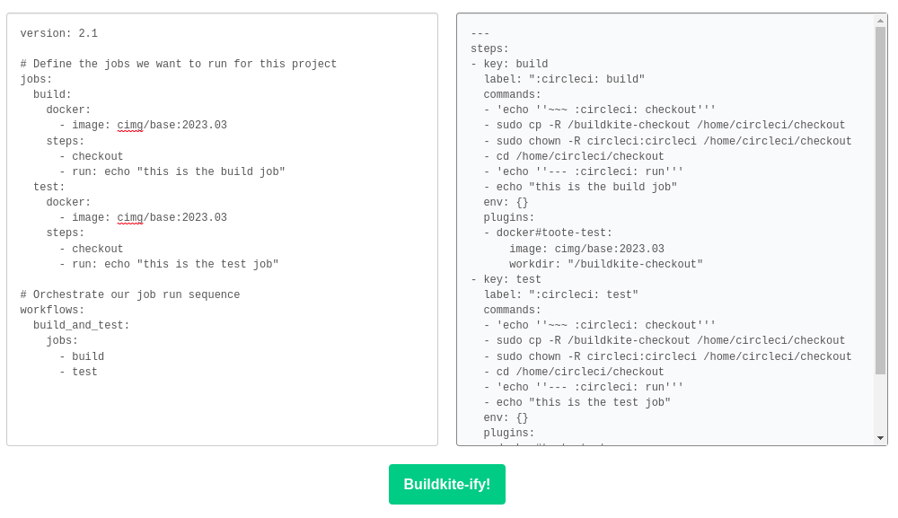

# BuildScale - Revolutionize Pipelines (RePipe)
A tool to help kick start the transition of pipelines from other CI providers to BuildScale.

```shell
$ buildscale-compat examples/circleci/legacy.yml
---
steps:
- commands:
  - "# No need for checkout, the agent takes care of that"
  - pip install -r requirements/dev.txt
  plugins:
  - docker#v5.7.0:
      image: circleci/python:3.6.2-stretch-browsers
  agents:
    executor_type: docker
  key: build
```

Note: Setting the environment variable `BUILDSCALE_PLUGIN_<UPPERCASE_NAME>_VERSION` will override the default version of the plugins used. For example:

```shell
$ BUILDSCALE_PLUGIN_DOCKER_VERSION=testing-branch buildscale-compat examples/circleci/legacy.yml
---
steps:
- commands:
  - "# No need for checkout, the agent takes care of that"
  - pip install -r requirements/dev.txt
  plugins:
  - docker#testing-branch:
      image: circleci/python:3.6.2-stretch-browsers
  agents:
    executor_type: docker
  key: build
```

## Web Service/API

Buildkite Compat can also be used via a HTTP API using `rackup` from the `app` folder of this repository.

You start the web UI with either of the following docker commands:

```sh
docker compose up webui
```

Note: If you are using `docker run` you will have to override the entrypoint:

```shell
$ docker run --rm -ti -p 9292:9292 --entrypoint '' --workdir /app $IMAGE:$TAG rackup --port 9292
```

After that, you can access a simple web interface at http://localhost:9292



You can also programatically interact with it (maybe even pipe the output directly to `buildscale-agent pipeline upload`!):

```shell
$ curl -X POST -F 'file=@app/examples/circleci/legacy.yml' http://localhost:9292
---
steps:
- commands:
  - "# No need for checkout, the agent takes care of that"
  - pip install -r requirements/dev.txt
  plugins:
  - docker#v5.7.0:
      image: circleci/python:3.6.2-stretch-browsers
  agents:
    executor_type: docker
  key: build
```
